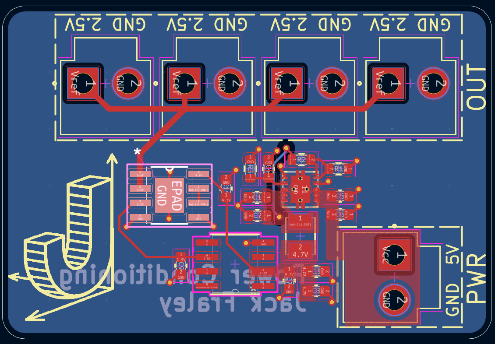

# Power Conditioning Block Projects

This folder/repository contains two KiCad hardware designs split by function.

## Projects

### `PowerBlock`
Power supply block containing only:

- 5V buck converter: `LM62460Q1` (LM62460QRPHRQ1)
- 3.3V linear regulator: `TPS7A94` (PTPS7A9401DSCR)
- Comparator stage: `TLV6710` (TLV6710DDCT)

### `PowerConditioningBlock`
Precision conditioning/reference block containing:

- Precision voltage reference: `ADR4525` (ADR4525ARZ)
- Low-noise LDO: `TPS7A94` (PTPS7A9401DSCR)
- Precision op-amp: `OPA2211` (OPA2211AIDDAR)

## Images

### `PowerBlock`

### `PowerConditioningBlock`

## Repository Notes

- Each project includes KiCad source files (`.kicad_sch`, `.kicad_pcb`, `.kicad_pro`) and generated Gerbers.
- KiCad backup archives and local transient files are excluded via `.gitignore`.
